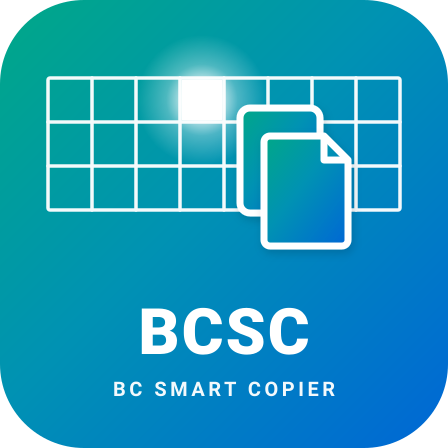
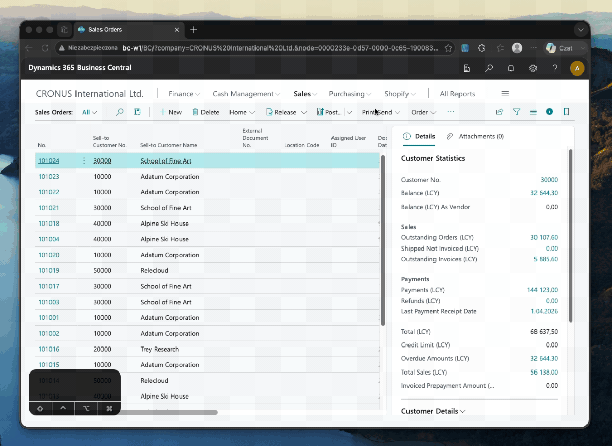

  

<h1 align="center">BC Smart Copier</h1>

  A lightweight browser extension for <b>Microsoft Dynamics 365 Business Central</b>.

---

## 🎬 Demo

  

---

## 🚀 Shortcuts & Actions

| Default shortcut | Action | Example output |
|---|---|---|
| `Alt` + **Click** | Copy cell value | `10000` or `[No.]` |
| `Alt` + `Shift` + **Click** | Copy action path | `open page [Sales Orders] and go to [Related] tab -> [Documents] and click {Prepayment Invoices}` |

On Mac, `Alt` is the `Option ⌥` key.

### ⌨️ Custom shortcuts

Both shortcuts can be changed in the extension popup (**Keyboard shortcuts** section). Available options: `Alt`, `Shift`, `Ctrl / Cmd ⌘` and the combinations `Alt + Shift`, `Ctrl + Shift`, `Ctrl + Alt`. The two shortcuts must be different.

> **Warning**: `Ctrl / Cmd ⌘ + Click` is used by Business Central to select multiple rows. While a shortcut using `Ctrl / Cmd ⌘` is active, that multi-row selection will not work.

---

## 💡 How it works

### Copy Cell Value — `Alt` + Left Click
1. Hold **ALT** (or **OPTION ⌥** on Mac).
2. Left-click any cell, field, or column header in Business Central.
3. The clean text value is automatically sanitized and copied to your clipboard (Boolean fields are copied as `Yes` / `No`).
4. The cell briefly highlights in green, and a Toast notification displays the copied value.

### Copy Action Path — `Alt` + `Shift` + Left Click
1. Hold **ALT + SHIFT** (or **OPTION ⌥ + SHIFT** on Mac).
2. Left-click any action button in the BC toolbar or action bar.
3. The extension extracts the **Page Name**, **Active Tab**, **Submenu hierarchy**, and **Action Button label** and copies a structured path to your clipboard.
4. Examples:
   - **Direct action**: `open page [Sales Order] and go to [Home] tab and click {Post}`
   - **Nested submenu**: `open page [Sales Orders] and go to [Related] tab -> [Documents] and click {Prepayment Invoices}`

> **Note**: Both shortcuts block the whole click gesture (`preventDefault()` / `stopPropagation()`) to prevent unintended BC or browser actions — such as link navigation, entering edit mode, opening report request pages, or the browser's Alt + Click link download.

---

## ✨ Key Features

- **Smart Text Sanitization**: Automatically converts non-breaking spaces (`\u00A0`), normalizes line breaks, and trims excess whitespace.
- **Stacked Toast Feedback**: Green cell outline animation and stacked floating Toast notifications (anchored bottom-center, top-inserted, 4-second duration, capped at 5 visible toasts).
- **Toggle Control & Custom Shortcuts**: Enable or disable the extension and choose your own shortcuts via the toolbar popup.
- **100% Private & Local**: Runs entirely inside your browser with zero external network tracking or data collection.

---

## 🛠️ Installation Guide (Microsoft Edge / Google Chrome)

Load directly from source files (Developer Mode):

### For Microsoft Edge:
1. Open Microsoft Edge and go to: `edge://extensions`
2. Turn on the **Developer mode** toggle in the bottom left corner.
3. Click **Load unpacked**.
4. Select the project directory.
5. Done! The extension icon will appear in the toolbar.

### For Google Chrome:
1. Open Google Chrome and go to: `chrome://extensions`
2. Turn on the **Developer mode** toggle in the top right corner.
3. Click **Load unpacked**.
4. Select the project directory.
5. Done!

---

## 📂 Project Structure

- `manifest.json` – Extension configuration (Manifest V3).
- `content/content.js` – Two configurable shortcuts: copy cell value (default `Alt + Click`) and copy the full action path including submenus (default `Alt + Shift + Click`, Page › Tab › Submenu › Action).
- `content/content.css` – Styles for cell highlight animation and Toast notifications.
- `popup/` – Popup interface: enable/disable toggle and shortcut configuration.
- `assets/icons/` – Extension icons set (SVG sources & PNG formats).
- `assets/docs/` – Documentation assets and demo recordings.

---

## 📜 Changelog

See [CHANGELOG.md](CHANGELOG.md) for full version history and release notes.